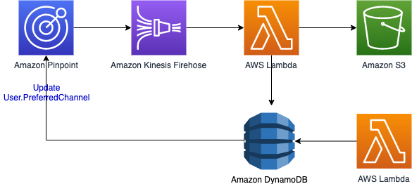
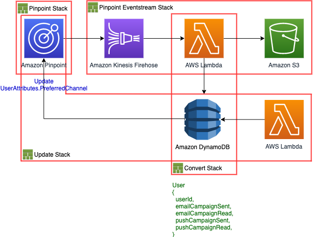

# Using preferred channel for Amazon Pinpoint
project: **aws_pinpoint_update_preferred_channel**

AWS CDK architecture on updating the preferred channel attribute of endpoints for Amazon Pinpoint

# Overview


# Stack


 * `Pinpoint Stack`
 * `Pinpoint Eventstream Stack`
 * `Update Stack`

# How to deploy

The `cdk.json` file tells the CDK Toolkit how to execute your app.

 * `cdk deploy '*'` deploy this stack to your default AWS account/region

# Guide
Amazon Pinpoint can capture user's preferred channel by using Event stream
When create a campaign, events such as `_campaign.send` is created.
And `_email.open` or `_campaign.opened_notification` is created when the user read campaigns.

Using this, Let's update the preferred channel information at User.UserAttribute.PreferredChannel of each endpoints on Amazon Pinpoint

## Prerequisite
* All endpoints should contain `User.UserId`
* Pinpoint Project should have two or more channels

## Campaign Send
No matter which channel the campaign is carried out, the below data is generated.
```json
{
  "event_type": "_campaign.send",
  "event_timestamp": 1592401347688,
  "arrival_timestamp": 1592401348004,
  "event_version": "3.1",
  "application": {
    "app_id": "c6504a2cca654c0f8415184859857fdc",
    "sdk": {
      
    }
  },
  "client": {
    "client_id": "email-a"
  },
  "device": {
    "platform": {
      
    }
  },
  "session": {
    
  },
  "attributes": {
    "campaign_activity_id": "fd9572a427044fff91e108f0c7ae98c7",
    "campaign_send_status": "SUCCESS",
    "campaign_type": null,
    "treatment_id": "0",
    "campaign_id": "879fe27d66bc467fba5ac3eb7000de0a"
  },
  "client_context": {
    "custom": {
      "endpoint": "{\\"ChannelType\\":\\"EMAIL\\",\\"EndpointStatus\\":\\"ACTIVE\\",\\"OptOut\\":\\"NONE\\",\\"RequestId\\":\\"886da836-46d5-4a41-b872-629e9b89a3d0\\",\\"Location\\":{},\\"Demographic\\":{},\\"EffectiveDate\\":\\"2020-06-17T12:26:00.299Z\\",\\"Attributes\\":{\\"items\\":[\\"Sports\\",\\"Travel\\",\\"fdasdfasdf\\"]},\\"User\\":{\\"UserId\\":\\"user-a\\",\\"UserAttributes\\":{\\"purchased\\":[\\"item_id_1\\",\\"item_id_2\\"]}}}"
    }
  },
  "awsAccountId": "228166257889"
}
```
The most important part is `client_context.custom.endpoint`.

You can obtain `campaign_id` and `ChannelType` by analyzing this information.
You can also obtain `client_id` of Endpoint at `client.client_id`

Using these attribute, you can write item to PreferredTable of DynamoDB

**Item**
```json
{
  "client_id": client.client_id,
  "campaign_id": attributes.campaign_id,
  "channel": ChannelType at client_context.custom.endpoint,
  "send": true
}
```
**Table**
|client_id|campaign_id|channel|send|read|
|---|---|---|---|---|
|email-a|879fe27d66bc467fba5ac3eb7000de0a|EMAIL|true|-|
|email-b|879fe27d66bc467fba5ac3eb7000de0a|EMAIL|true|-|
|email-c|879fe27d66bc467fba5ac3eb7000de0a|EMAIL|true|-|

## Email Open
When you create Email campaigns, the below data is generated
```json
{
    "event_type": "_email.open",
    "event_timestamp": 1592400525986,
    "arrival_timestamp": 1592403096590,
    "event_version": "3.1",
    "application": {
        "app_id": "c6504a2cca654c0f8415184859857fdc",
        "sdk": {}
    },
    "client": {
        "client_id": "email-a"
    },
    "device": {
        "platform": {}
    },
    "session": {},
    "attributes": {
        "feedback": "opened",
        "treatment_id": "0",
        "campaign_activity_id": "a7f6cc9423864c6bb11f26d988d91de8",
        "campaign_id": "8cbf7ef12c134bbd9ac3bb36c5eab900"
    },
    "client_context": {
        "custom": {
            "legacy_identifier": "c6504a2cca654c0f8415184859857fdc"
        }
    },
    "awsAccountId": "228166257889",
    "facets": {
        "email_channel": {
            "mail_event": {
                "mail": {
                    "message_id": "02010000gbjqulvk-cs5jm2tp-2sp5-e2k5-25j4-ooebtil3tjg0-000000",
                    "message_send_timestamp": 1592400525986,
                    "from_address": "jakemraz100@gmail.com",
                    "destination": [
                        "jakemraz100+a@gmail.com"
                    ],
                    "headers_truncated": false,
                    "headers": [
                        {
                            "name": "Date",
                            "value": "Wed, 17 Jun 2020 13:28:46 +0000"
                        },
                        {
                            "name": "From",
                            "value": "jakemraz100@gmail.com"
                        },
                        {
                            "name": "To",
                            "value": "jakemraz100+a@gmail.com"
                        },
                        {
                            "name": "Message-ID",
                            "value": "<1855182322.69487.1592400526261.JavaMail.ec2-user@ip-10-0-47-42.us-west-2.compute.internal>"
                        },
                        {
                            "name": "Subject",
                            "value": "user-a Test"
                        },
                        {
                            "name": "MIME-Version",
                            "value": "1.0"
                        },
                        {
                            "name": "Content-Type",
                            "value": "text/html; charset=UTF-8"
                        },
                        {
                            "name": "Content-Transfer-Encoding",
                            "value": "7bit"
                        }
                    ],
                    "common_headers": {
                        "from": "jakemraz100@gmail.com",
                        "date": "Wed, 17 Jun 2020 13:28:46 +0000",
                        "to": [
                            "jakemraz100+a@gmail.com"
                        ],
                        "subject": "user-a Test"
                    }
                },
                "open": {
                    "ip_address": "205.251.233.178",
                    "user_agent": "Mozilla/5.0 (Macintosh; Intel Mac OS X 10_14_6) AppleWebKit/605.1.15 (KHTML, like Gecko)"
                }
            }
        }
    }
}

```
By referring to this data, we can obtain the following values.
```json
{
  "client_id": client.client_id,
  "campaign_id": attributes.campaign_id,
  "channel": "EMAIL", // because this is an _email.open event
  "read": 1,
  "send": 1
}
```
Using this value, you can put item to DynamoDB table (See the fourth row)

**Table**
|client_id|campaign_id|channel|send|read|
|---|---|---|---|---|
|email-a|879fe27d66bc467fba5ac3eb7000de0a|EMAIL|true|-|
|email-b|879fe27d66bc467fba5ac3eb7000de0a|EMAIL|true|-|
|email-c|879fe27d66bc467fba5ac3eb7000de0a|EMAIL|true|-|
|email-a|8cbf7ef12c134bbd9ac3bb36c5eab900|EMAIL|true|true|
|...|...|...|...|...|

## Push Open
When user opens push notification, `_campaign.opened_notification` is generated regardless of APNS or GCM.

c.f) Amazon Pinpoint uses `GCM` as a channel_type regardless of `GCM` or `FCM` ([Link](https://docs.aws.amazon.com/pinpoint/latest/developerguide/send-messages-push.html))

```json
{
  "event_type": "_campaign.opened_notification",
  "event_timestamp": 1574861306622,
  "arrival_timestamp": 1574861307502,
  "event_version": "3.1",
  "application": {
    "app_id": "c6504a2cca654c0f8415184859857fdc",
    "cognito_identity_pool_id": "us-west-2:47e7f139-b83a-4544-8409-42e235730000",
    "package_name": "kr.jhb.aws_pinpoint_android",
    "sdk": {
      "name": "aws-sdk-android",
      "version": "2.15.2"
    },
    "title": "aws_pinpoint_android",
    "version_name": "1.0",
    "version_code": "1"
  },
  "client": {
    "client_id": "gcm-a",
    "cognito_id": "us-west-2:b5d8c6e2-7da9-3ff1-a891-56e8a4cb0000"
  },
  "device": {
    "locale": {
      "code": "en_US",
      "country": "US",
      "language": "en"
    },
    "make": "Google",
    "model": "Android SDK built for x86",
    "platform": {
      "name": "android",
      "version": "9"
    }
  },
  "session": {
    "session_id": "00000000-00000000",
    "start_timestamp": 0
  },
  "attributes": {
    "treatment_id": "0",
    "campaign_activity_id": "082d5a336e3148bb9f79220147c30000",
    "campaign_id": "e10fa310e3434c3087397bcffad40000"
  },
  "endpoint": {
    "ChannelType": "GCM",
    "Address": "=ABAQ8rfmFOeZTLCgRSb7iCsfN6cZALe9vE+8D3tDLwKePVmrONUGRaSM0rOqwZTnsOaLbkfUjH8E6mVjQzj7dhv0uklVNVQfJr2bi7kXWb8Q8UQyXkMlvtMWI9wVXXmg4unDhmAdgtpQHVnQpZa70fKIGiaAt5YrhT02e6XLwDhVkW9cpDOcgDPcD/XQjZlG6bJwxX2+PSkKiJ8TB3MGbXB4jJMJKH3G4pYK3EOjToDA+4ZyxNwrI4iZdvc2L4+5fEAsqpfEzRzHbiDqoOPBKBIs0000",
    "EndpointStatus": "ACTIVE",
    "OptOut": "NONE",
    "RequestId": "7107bb9b-4d0c-4c9a-991d-dff1e1580000",
    "Location": {
      "PostalCode": "",
      "City": "",
      "Region": "",
      "Country": "USA"
    },
    "Demographic": {
      "Make": "Google",
      "Model": "Android SDK built for x86",
      "Timezone": "Asia/Seoul",
      "Locale": "en_US",
      "AppVersion": "1.0",
      "Platform": "android",
      "PlatformVersion": "9"
    },
    "EffectiveDate": "2019-11-27T12:06:08.985Z",
    "Attributes": {
      
    },
    "Metrics": {
      
    },
    "ApplicationId": "c6504a2cca654c0f8415184859857fdc",
    "Id": "gcm-a",
    "CohortId": "13",
    "CreationDate": "2019-11-27T10:08:17.702Z"
  },
  "awsAccountId": "228166257889"
}
```
You can get below information using above event
```json
{
  "client_id": client.client_id,
  "campaign_id": attributes.campaign_id,
  "channel": "GCM" | "APNS" | etc...,
  "send": 1,
  "read": 1
}
```

And this item can be written in the table.
(See the fifth row)

**Table**
|client_id|campaign_id|channel|send|read|
|---|---|---|---|---|
|email-a|879fe27d66bc467fba5ac3eb7000de0a|EMAIL|true|-|
|email-b|879fe27d66bc467fba5ac3eb7000de0a|EMAIL|true|-|
|email-c|879fe27d66bc467fba5ac3eb7000de0a|EMAIL|true|-|
|email-a|8cbf7ef12c134bbd9ac3bb36c5eab900|EMAIL|true|true|
|gcm-a|e10fa310e3434c3087397bcffad40000|GCM|true|true|
|...|...|...|...|...|


# Retrospective
* The open events don't contain UserId information. With this information, I could create a better architecture.
* In order to change User Attribute, we should call `UpdateEndpoint` or `UpdateEndpointsBatch` API and client_id must be necessary. I think only user_id is necessary when I change only User Attributes.
* _email.open events keep coming in every time I open an email. Even if I've already opened the e-mail.