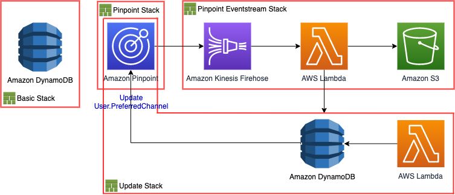

# aws_pinpoint_update_preferred_channel
AWS CDK architecture on updating the preferred channel attribute of endpoints for Amazon Pinpoint

# Overview

# Stack

 * `Pinpoint Stack`
 * `Pinpoint Eventstream Stack`
 * `Convert Stack`
 * `Update Stack`

# How to deploy

The `cdk.json` file tells the CDK Toolkit how to execute your app.

 * `cdk deploy` deploy this stack to your default AWS account/region
